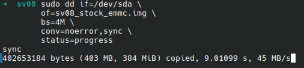
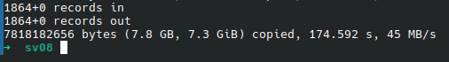
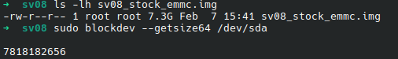
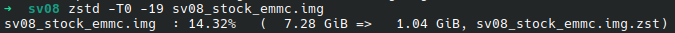
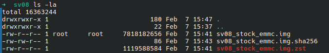

## Backup Stock eMMC

Back up configs either from the Mainsail UI or by mounting the eMMC and copying `/home/sovol/printer_data`. I also copy `/home/sovol` as a safety net. It's normal to see warnings for symlinks or Unix sockets; those should not be copied.

I also recommend a full eMMC image backup using a tool like `dd`.

1. Use `lsblk` to identify your eMMC device

```bash
lsblk -o NAME,MODEL,SIZE,TYPE,FSTYPE,MOUNTPOINTS
```

You would get output like this where `sda` is the eMMC device, though yours will be different.

```bash
$ lsblk -o NAME,MODEL,SIZE,TYPE,FSTYPE,MOUNTPOINTS
NAME        MODEL                  SIZE TYPE FSTYPE   MOUNTPOINTS
...
sda         STORAGE DEVICE         7.3G disk
|-- sda1                            256M part vfat     /media/username/BOOT
`-- sda2                            6.9G part ext4     /media/username/XXXXXXXX-XXXX-XXXX-XXXX-XXXXXXXXXXXX
...
```

1. In my case Linux auto-mounted `sda1` and `sda2`, so we need to stop them first (ignore if yours is not mounted):

```bash
sudo umount /dev/sda1
sudo umount /dev/sda2
```

1. Make a `dd` image of the disk (double-check the device from step 1)

```bash
sudo dd if=/dev/sda \
        of=sv08_stock_emmc.img \
        bs=4M \
        conv=noerror,sync \
        status=progress
sync
```



After it's done you should see a message like this with no errors



1. Validate and compress the resulting image

To validate we'll look at the resulting file and compare the size to the eMMC partition:

```bash
ls -lh sv08_stock_emmc.img
sudo blockdev --getsize64 /dev/sda
```



Image size: **7.3 G**

Device size: **7,818,182,656 bytes** (about **7.28 GiB**)

So everything is fine and we can continue creating the hash file to validate integrity later if needed

```bash
sha256sum sv08_stock_emmc.img > sv08_stock_emmc.img.sha256
```

And finally compress the image for storage

```bash
zstd -T0 -19 sv08_stock_emmc.img
```



You should end with these files, and can safely delete the original .img file and keep the compressed (.zst) version that should be about 1 GB instead of 7 GB



You can continue now to [Install Latest Armbian on CB1 and Prepare OS](../2-install-latest-armbian/README.md)
