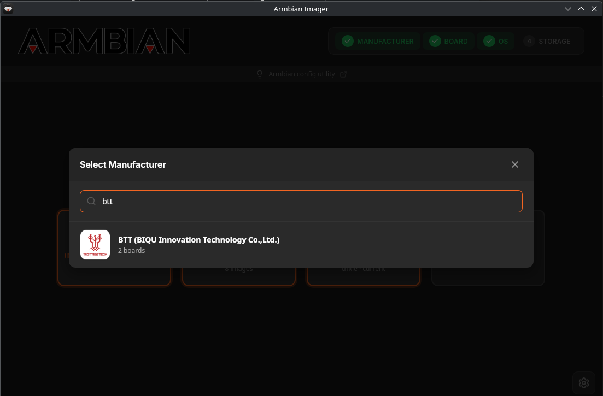
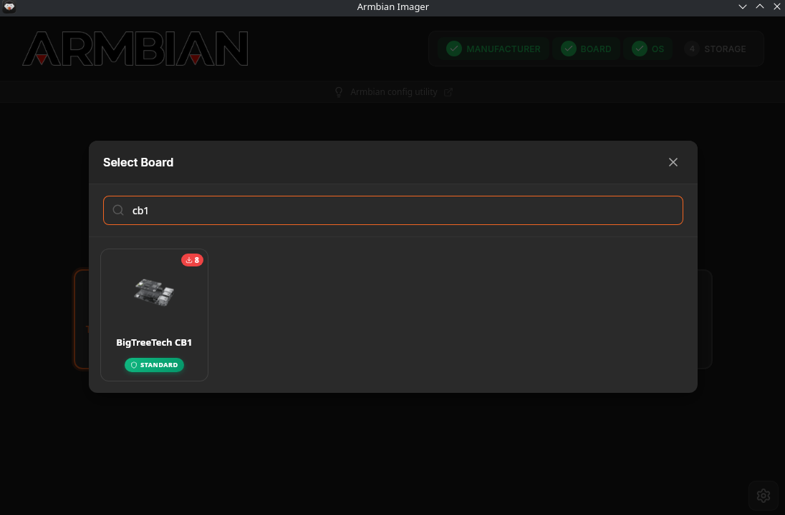
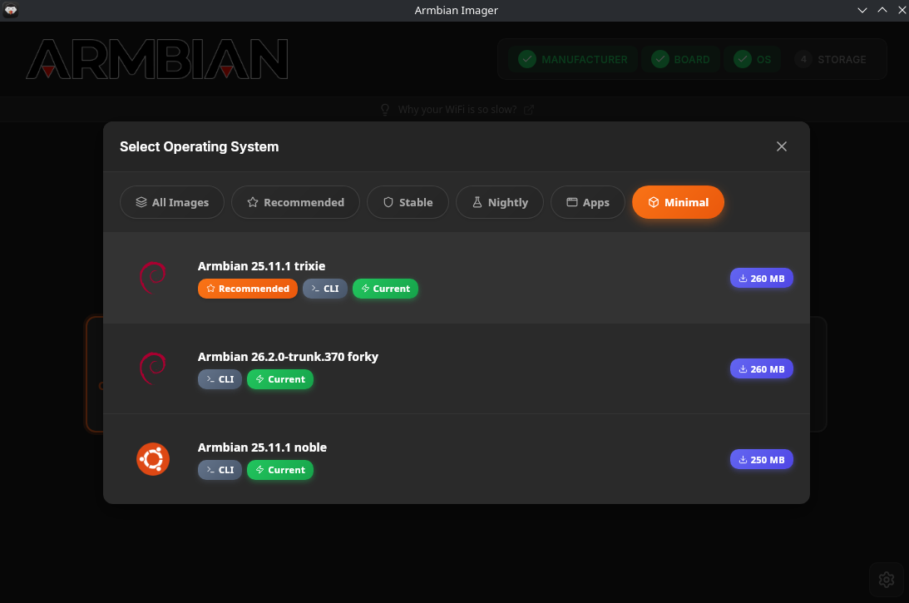
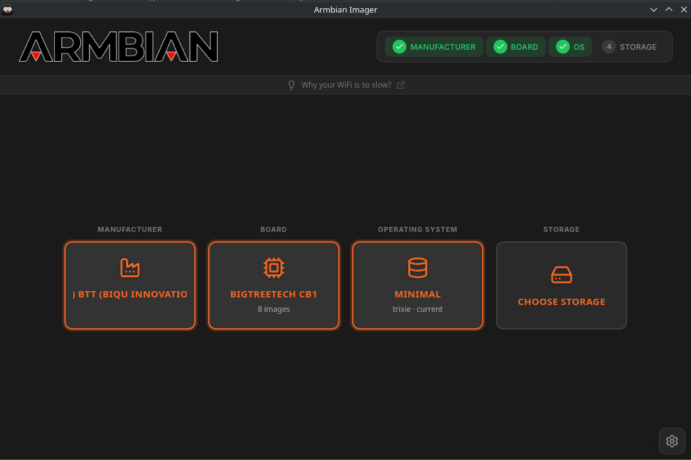
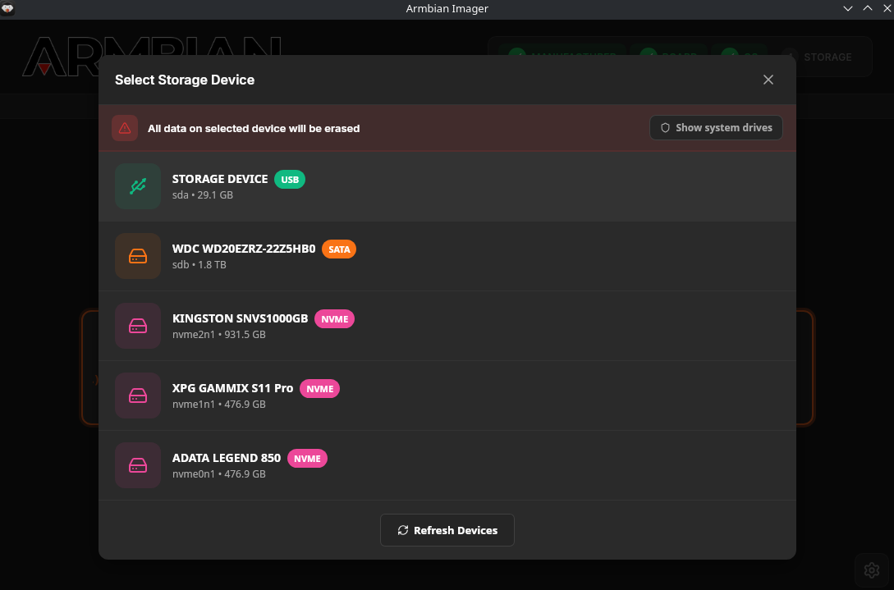
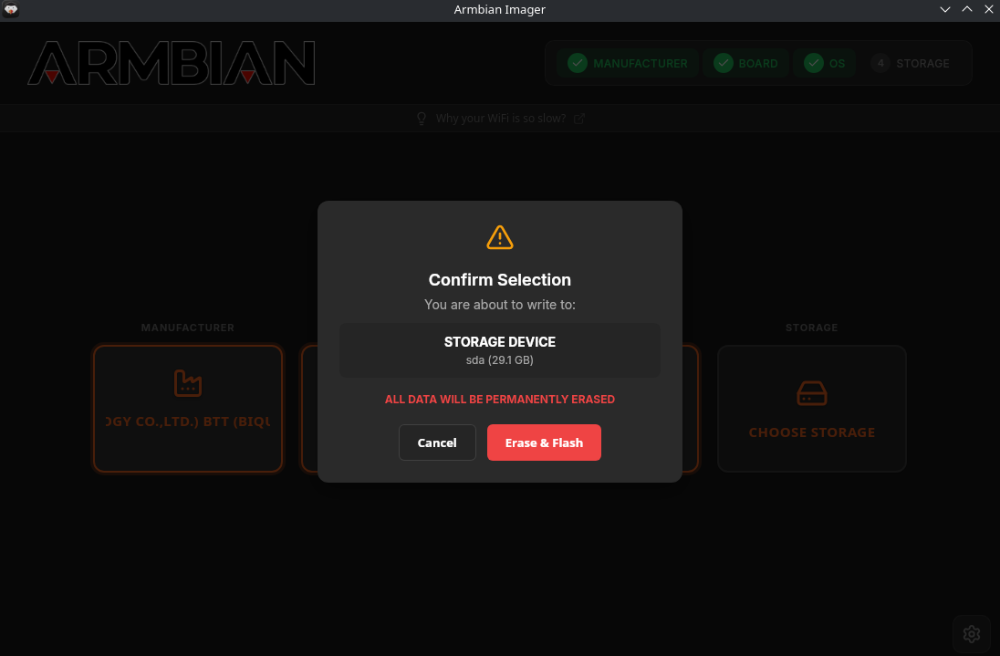
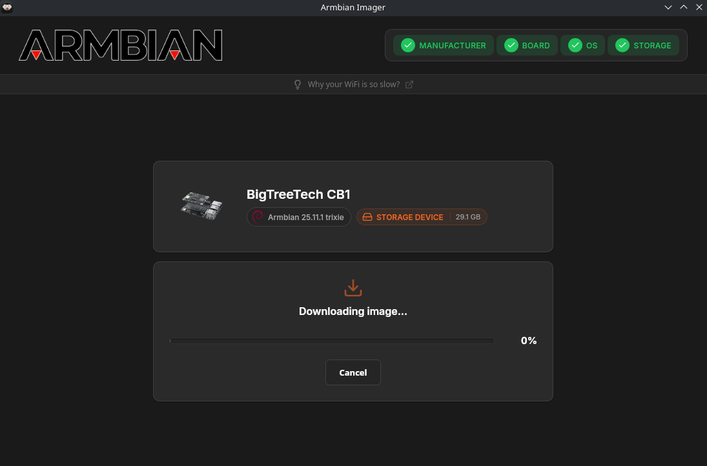
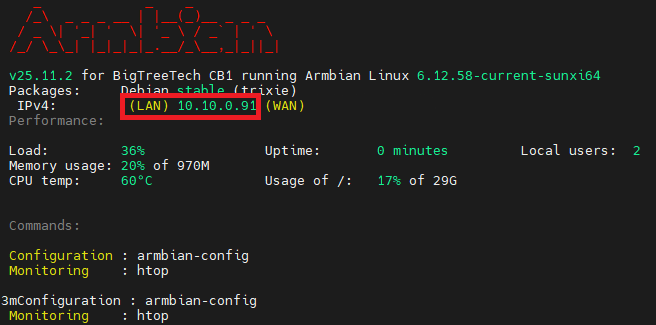

## Install Latest Armbian on CB1 and Prepare OS

1. Download [Armbian Imager](https://imager.armbian.com/)

2. Insert your eMMC with the adapter and flash it:

* Select `BTT (BIQU)` Manufacturer



* Select `BigTreeTech CB1` Board



* Select `Minimal` tab, then `Armbian 25.11.1 Trixie` OS



The selection should look like this



* Click `Choose Storage`, and select your eMMC drive



* Confirm write by clicking `Erase and Flash`



It will start downloading and writing (to allow writing to the disk you might be prompted for your password)




3. On the eMMC, edit `/boot/armbianEnv.txt` and set it to (keep a copy of the original file first):
```bash
verbosity=1
bootlogo=false
console=display
disp_mode=1920x1080p60
overlay_prefix=sun50i-h616
fdtfile=sun50i-h616-bigtreetech-cb1-emmc.dtb
rootdev=UUID=<YOUR_UUID>
rootfstype=ext4
overlays=uart3
overlays=ws2812
overlays=spidev1_1
usbstoragequirks=0x2537:0x1066:u,0x2537:0x1068:u
```
In your file this line already has the correct UUID for your eMMC. Keep that value (use `blkid` to verify if needed). Do not overwrite it with the placeholder above.

4. Fix the partition size on the eMMC: `sudo fdisk /dev/<device>` then `e`, `2`, `<enter>`, `w`

5. Insert the eMMC back into the printer, connect a keyboard and display to the HDMI port, and turn it on. You'll first be prompted to log in (default user is `root`, password `1234`). Then you'll be prompted to create the root password, a local user, set up locale, and finally connect to Wi-Fi. For more info see [Armbian first login docs](https://docs.armbian.com/User-Guide_Getting-Started/#first-login)

6. From here you can then connect through SSH using the user/password you just created and the LAN IP address of the printer (you can see it after logging in)



7. Update OS packages by running:
```bash
sudo apt update && sudo apt upgrade -y && sudo apt dist-upgrade -y && sudo apt autoremove -y && sudo apt autoclean -y
```
8. Install Git
```bash
sudo apt install git python3-pip -y
```

9. Clone KIAUH
```bash
git clone https://github.com/dw-0/kiauh.git
./kiauh/kiauh.sh
```

10. From this point on, you can follow step 4 of the [Rappetor guide](https://github.com/Rappetor/Sovol-SV08-Mainline?tab=readme-ov-file#step-4---install-mainline-klipper)
